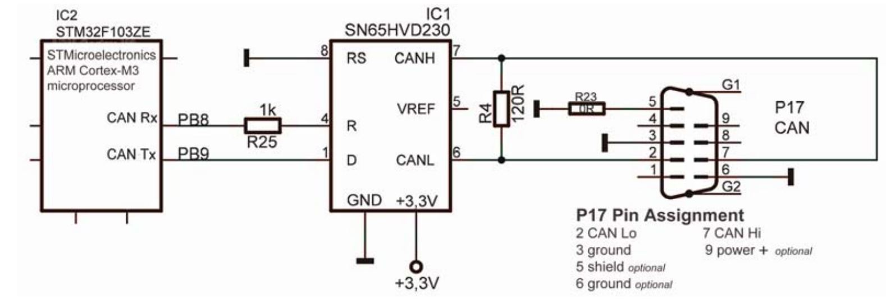

# stm32f1-master-example

This project contains all peripherals' usage samples in it!

Covered features is like;

## [application_firmware](https://github.com/dogusyuksel/stm32f1-master-example/tree/master/application_firmware)

1. github actions
2. I2C usage with lsm6dsm
3. CANBUS usage
4. UART usage
5. RTOS usage and multitasking
6. RTC Usage
7. IO operations on STM
8. HAL Driver usage
9. PPS Generation
10. ADC Usage

## [bootloade_firmware](https://github.com/dogusyuksel/stm32f1-master-example/tree/master/bootloader_firmware)

1. github actions
2. unity ceedling unit tests
3. SPI usage with MC25LC512 EEPROM
4. UART usage
5. RTOS usage and multitasking
6. Internal Flash usage
7. IO operations on STM
8. HAL Driver usage

## [application_boot_from_ram](https://github.com/dogusyuksel/stm32f1-master-example/tree/master/application_boot_from_ram)

This is a good example about how an stm32 firmware is initiated from RAM. The key point of it is the linker script

## [bootloader_copy_to_ram](https://github.com/dogusyuksel/stm32f1-master-example/tree/master/bootloader_copy_to_ram)

This is a good example about how a bootloader loads a firmware into RAM and jumps.

## [bootloader_tool](https://github.com/dogusyuksel/stm32f1-master-example/tree/master/bootloader_tool)

This is the PC tool and used as FW flashed throught UART and serial terminal

## [application_tool](https://github.com/dogusyuksel/stm32f1-master-example/tree/master/application_tool)

This is the PC tool and used to broadcast packets and dump incoming packets throught CANBUS

# hardware schematics

1. LSM6DSM I2C Interface

2. CANBUS

3. UART

3. ADC

3. REGULATOR

3. MC25LC512

# Notes

Please check individual folders' README.md files

[More on RTOS](https://github.com/dogusyuksel/rtos_hal_stm32)

[More on WDT 1](./docs/stm32-IWDT.pdf)

[More on WDT 2](./docs/Watchdog.md)

[More on power modes](./docs/PowerModes.txt)

[More on power PWM](./docs/STM32_tutorial_PWM.pdf)

[And other tutorials](./docs)

