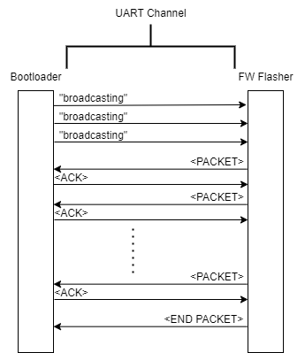

# STM32F103 UART BOOTLOADER with HAL and RTOS

This project is UART Bootloader project basically but actually it is a container project to work on the following contents;

1. github actions
2. unity ceedling unit tests
3. SPI usage with MC25LC512 EEPROM
4. UART usage
5. RTOS usage and multitasking
6. Internal Flash usage
7. IO operations on STM
8. HAL Driver usage

## How to Build

More detailed steps can be found in the GHA yml file but basically;

1. You need to setup the environment

```
cd ..
./setup_environment.sh
```

2. To build firmware

```
./build.sh       // to compile the project in Debug mode
./build Release  // to compile the project in Release mode
```

3. To build fw flasher

```
cd ../bootloader_tool
make
```

## How to Use

1. To execute the flasher, you need to give 2 parameters, like <serial_iface_name> <bin_file_path>

```
./serial.exe /dev/ttyUSB0 ./example_application.bin
```

2. To flash the FW, you can execute the "flash.sh" script after successful build

Please note that, this bootloader's size is too big. Normally a bootloader should not be like big but this is not the case for my purpose.
Please note that, if your MCU's flash size 64KB like mine, I suggest you to use "example_application.bin" to flash because its size is so small.

Bootloader's jump address is PAGE 50 in our case!!

## How to Debug

1. You can execute the "start_ocd.sh" to start the OpenOCD.
2. Proper environent setting for OpenOCD, you may follow thirdparty/docker/Dockerfile
3. Then follow the instructions inside the "start_ocd.sh" script
4. For more gdb usage notes, please check "docs"

## Communication Session Details

### Packet Sequence

Implemented packet sequence is really simple and need to be improved.

Please check the diagram below




### Packet Contents

Please note that, whole packets coming from the bootloader to the flasher are ascii based and ending with '\n'

#### Broadcast

"broadcasting\n"

#### Packet

| constant 3 bytes | Counter 1 byte | Data 1024 bytes | CRC 4 bytes |
| ---------------- | -------------- | --------------- | ----------- |
| 'KDY'            | IDX            | payload         | CRC32       |


Where;
1. "KDY" bytes are constant
2. IDX byte is counter starting from 0
3. payload size is the firmware binary content but FIXED sized (trailler bytes are 0xFF)
4. CRC32

#### End Packet

End Packet has the same format but the whole payload data is equals to 0xCC


#### ACK Packet

"OK:<IDX>\n" where IDX is the same with last Packet content's IDX.

